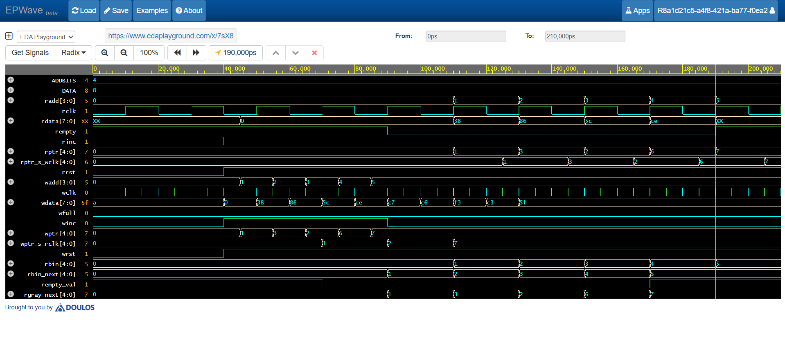
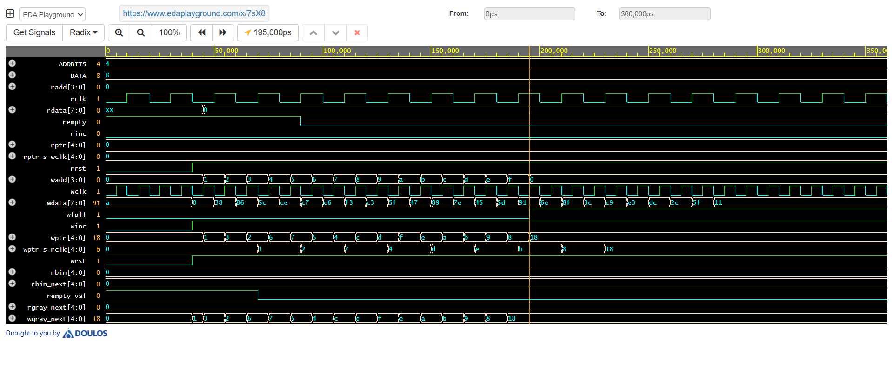
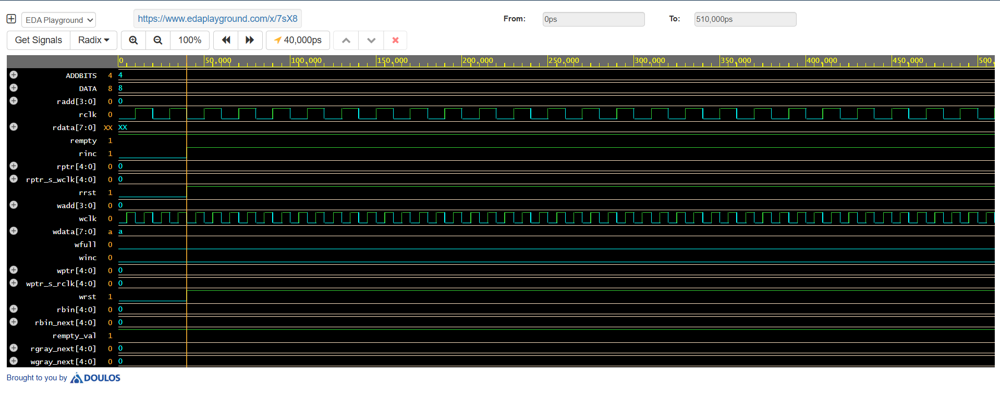

# Design and Verification of Asynchronous FIFO

## Specifications - 

- top module: instantiating the 4 modules together
- synchronizer module: to synchronize address pointer of domain A to clock of domain B
- memory module: to define the memory and reading and writing operations
- read pointer handler: for generating read address, read pinter and read empty conditions
- write pointer handler: for generating the write address, write pointer and write full conditions

- Size of data/ word = 8 bits [7:0]
- Size of address bit = 4 bits [3:0]
- Depth of fifo memory = 2^4 = 16

Inputs to the FIFO:
- wclk, rclk
- winc, rinc
- wrst, rrst
- wdata

Output of the FIFO:
- wfull, rempty
- rdata

Internal design objects for the top module (for linking the 4 modules of the FIFO):
- wadd, radd
- wptr, rptr
- wptr_s_rclk, rptr_s_wclk

Other internal design objects are also there, but those are within module and not intermodule.

## Output 

- ### Writing data and reading data

winc and rinc are set to 1: write and read operations are enabled

wdata is assigned random 8 bit value using $random(seed)

rdata is verified visually for correctness

- ### Writing data and checking FIFO full condition
 
winc is set to 1: to emable the writing process

when wgray_next == ~rptr_s_wclk[7:6], rptr_s_wclk[5:0], wfull is set to 1 disabling wdata to be transferred to fifo memory

- ### Reading data and checking FIFO empty condition

rinc is set to 1 to enable read operation

when rgray_next = wptr_s_rclk, rempty is set disabling radd to increment, therefore no data is read from fifo memory (as radd stays at its previous value)

